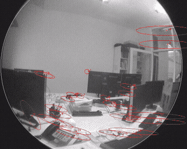
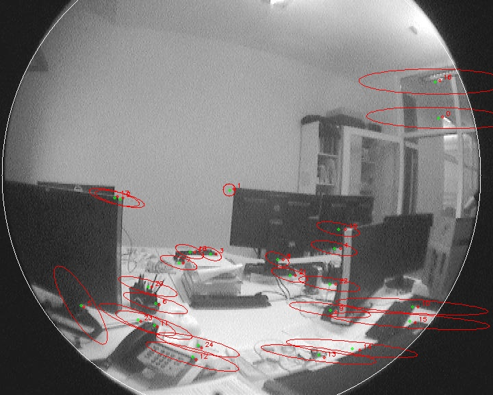
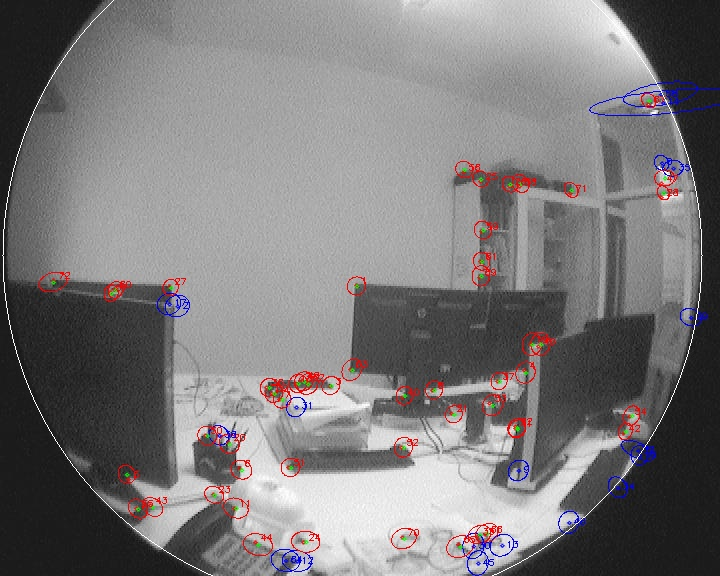
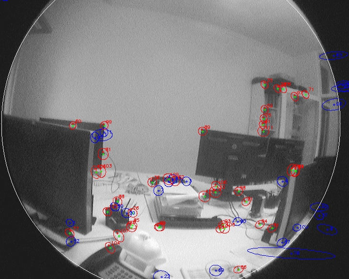
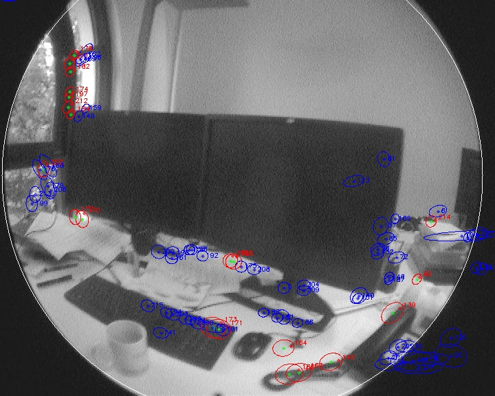
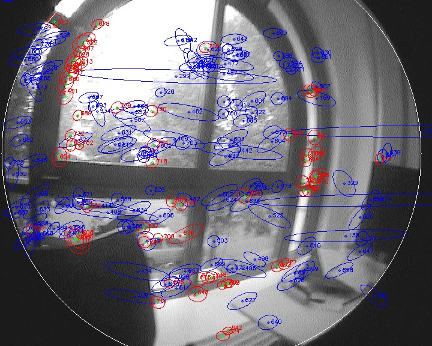
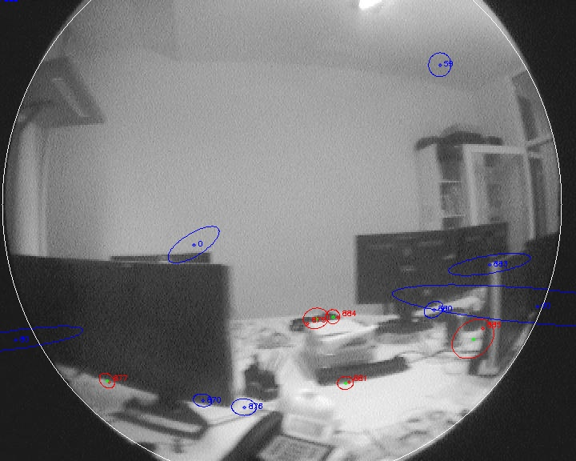
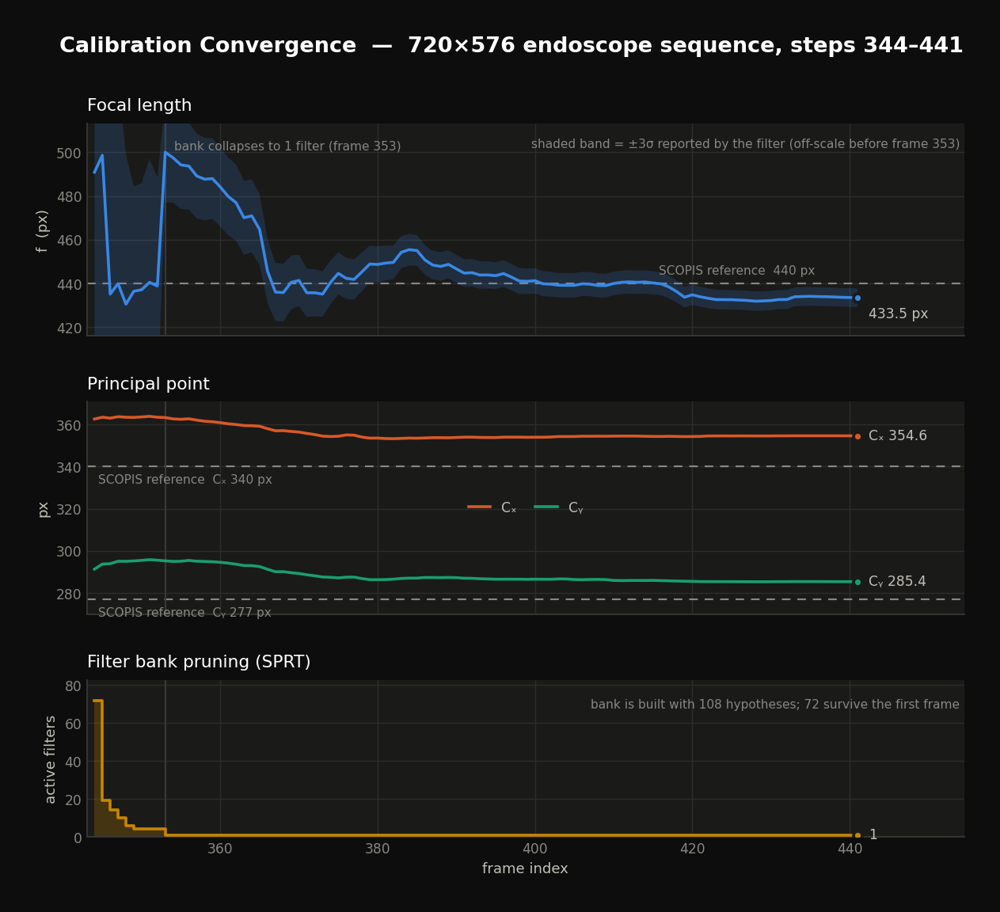

# MonoSLAM Auto-Calibration

Online **automatic intrinsic camera calibration** for surgical endoscopes using a **Gaussian Sum Filter** embedded in a Monocular SLAM pipeline.

Developed as an M.Sc. thesis project at **Technische Universität München (TUM)** in collaboration with **SCOPIS GmbH** (surgical navigation).

---

## Problem

Surgical endoscopes present a uniquely difficult calibration scenario:
- **Varying intrinsics** — focus and zoom adjustments during a procedure change focal length in real time
- **Lens distortion** — wide-angle optics introduce significant radial distortion
- **No calibration target** — a checkerboard cannot be used inside a patient

This project estimates the full intrinsic parameter set `[f, Cx, Cy, k1, k2]` online, directly from a live endoscope image stream, without interrupting the surgical workflow.

---

## Method

### Gaussian Sum Filter (GSF)

A **bank of Extended Kalman Filters** runs in parallel. Each filter is initialised with a different hypothesis for focal length `f` and radial distortion coefficients `k1`, `k2`, spanning the plausible range for the endoscope optics.

```
FilterBank
 ├── EKF₁  [f = f_min,       k1 = k1_start, k2 = k2_start]
 ├── EKF₂  [f = f_min + Δf,  ...]
 │    ...
 └── EKFₙ  [f = f_max,       k1 = k1_end,   k2 = k2_end ]
```

Each filter maintains a full MonoSLAM state: camera pose (3-DoF translation + quaternion orientation) + tracked feature map + camera intrinsics. All filters receive the same image observations; filters whose intrinsic hypotheses conflict with the observed feature motion accumulate low likelihood and are eliminated.

### Sequential Probability Ratio Test (SPRT)

After each frame a **log-likelihood ratio** is computed across the filter bank. The SPRT with thresholds `A` and `B` (derived from user-specified false-positive and false-negative error rates) decides when one hypothesis has accumulated sufficient evidence — pruning the bank until a single calibration estimate remains.

```
A = log₁₀((1 - β) / α)    B = log₁₀(β / (1 - α))
α = type-I  error rate     β = type-II error rate
```

### Feature Tracking

Patch-based template matching (OpenCV) detects and tracks corner features across consecutive frames. Matched correspondences feed the EKF measurement update for both the 3-D map and the intrinsic parameters simultaneously.

### State Vector (per EKF)

| Component | Dim | Description |
|-----------|-----|-------------|
| `f` | 1 | Focal length (pixels) |
| `Cx, Cy` | 2 | Principal point |
| `k1, k2` | 2 | Radial distortion coefficients |
| `r_wc` | 3 | Camera translation (world frame) |
| `q_wc` | 4 | Camera orientation (unit quaternion) |
| Features | 3×N | 3-D map point positions |

---

## Architecture

```
Mono_Exp_EndoIm/
├── Mono_Exp.cpp           # Entry point — frame loop & SPRT output
├── Monoslam.h / .cpp      # Top-level SLAM coordinator
├── FilterBank.h / .cpp    # GSF: pool of EKF instances
├── KalmanFilter.h / .cpp  # Single EKF (predict + update)
├── MotionModel.h / .cpp   # 6-DoF quaternion motion model
├── Camera.h / .cpp        # Intrinsic parameter model
├── DataAssociator.h / .cpp # Feature matching & data association
├── MathUtil.h / .cpp      # Quaternion / Jacobian utilities
└── Calibration_results/   # Output logs (f, Cx, Cy, k1, k2 per frame)
```

---

## Dependencies

| Library | Purpose |
|---------|---------|
| [OpenCV](https://opencv.org/) ≥ 2.4 | Image I/O, feature detection, patch matching |
| [Eigen](https://eigen.tuxfamily.org/) ≥ 3.2 | Matrix algebra for EKF state and covariance |
| C++11 compiler | MSVC 2013+ (original); GCC/Clang with minor porting |

---

## Build

Originally developed with **Visual Studio** on Windows. To build on Linux/macOS, replace `sprintf_s` with `snprintf` in `Mono_Exp.cpp` and use the following `CMakeLists.txt`:

```cmake
cmake_minimum_required(VERSION 3.5)
project(MonoSLAMAutoCalibration)

find_package(OpenCV REQUIRED)
find_package(Eigen3 REQUIRED)

file(GLOB SOURCES "Mono_Exp_EndoIm/*.cpp")
add_executable(mono_slam ${SOURCES})
target_include_directories(mono_slam PRIVATE ${EIGEN3_INCLUDE_DIR})
target_link_libraries(mono_slam ${OpenCV_LIBS})
```

```bash
mkdir build && cd build
cmake ..
make -j$(nproc)
```

---

## Running

1. Place the endoscope image sequence under `Mono_Exp_EndoIm/exp_scopis_im_2_720x576/` as `step<N>.jpg`
2. Set the start frame and range in `Mono_Exp.cpp`:

```cpp
int step_   = 344;   // starting frame index
int lastIm  = 900;   // last frame
```

3. Provide camera pixel-size and resolution in `camdata/cam.txt`
4. Run the binary — calibration estimates are appended to `cali_results.txt`:

```
frame   f (px)    Cx (px)   Cy (px)   k1       k2       filters_alive
344     247.546   160.000   120.000   0.04059  0.00878   108
345     203.928   159.937   119.886   0.04152  0.00907   108
...
400     172.683   158.286   119.550   0.05592  0.01459     4
```

The filter bank starts with 108 parallel hypotheses and prunes down as the SPRT accumulates evidence.

---

## Feature Tracking & Uncertainty Convergence

Each ellipse is the EKF **predicted search region** for a map feature; the dot is the **measured pixel position**.  
As the filter bank accumulates observations, ellipses shrink — reflecting reduced uncertainty in both feature positions and camera intrinsics.

| 🔴 Red ellipse | 🔵 Blue ellipse |
|---|---|
| High uncertainty — newly initialised or rarely observed | Low uncertainty — well-established, frequently matched |

### Tracking animation (step 344 → 441)

<video src="docs/tracking.mp4" controls loop width="640"></video>

*If the video does not render, view the animation below or [download the MP4](docs/tracking.mp4).*



---

### Frame-by-frame progression (step 344 → 441)

| Step 344 — Initialisation | Step 350 — Early tracking | Step 360 — Building map |
|:-:|:-:|:-:|
| Large red search regions | Red/blue mix, camera moving | Blue features appearing |
|  |  |  |

| Step 380 — Established tracking | Step 415 — Dense map | Step 441 — Converged |
|:-:|:-:|:-:|
| Mostly blue, ellipses tightening | Tight blue ellipses, few red | Small compact ellipses |
|  |  |  |

> The circular field of view and radial barrel distortion are characteristic of the wide-angle endoscope optics. The GSF estimates `f`, `Cx`, `Cy`, `k1`, `k2` online from exactly this imagery — no calibration target required.

---

## Convergence Plot

Focal length, principal point, and active filter count over the sequence. The filter bank starts with 108 hypotheses and is pruned by the SPRT until a single estimate remains.



---

## Results

Tested on a 720×576 SCOPIS endoscope sequence. The GSF converges within ~200 frames:

| Parameter | Converged estimate |
|-----------|-------------------|
| Focal length `f` | ~172–186 px |
| Principal point `(Cx, Cy)` | ~(158, 119) px |
| Radial distortion `k1` | ~0.054 |
| Radial distortion `k2` | ~0.015 |

The principal point converges reliably to stable values; residual focal-length variation is consistent with active zoom adjustment on the live endoscope.

---

## Academic Context

This project is a direct implementation of the **Gaussian Sum Filter for online camera self-calibration** described in:

> **J. Civera, A. J. Davison, and J. M. M. Montiel**,
> "Inverse Depth Parametrization for Monocular SLAM,"
> *IEEE Transactions on Robotics*, vol. 24, no. 5, pp. 932–945, Oct. 2008.
> DOI: [10.1109/TRO.2008.2003276](https://doi.org/10.1109/TRO.2008.2003276) · [PDF](https://webdiis.unizar.es/~jcivera/papers/civera_etal_tro08.pdf)

The paper introduces two key contributions implemented here:
1. **Inverse depth parametrization** for monocular feature initialisation, improving EKF linearisation accuracy over Cartesian coordinates
2. **Gaussian Sum Filter** (Section IV) — a bank of EKFs with different camera intrinsic hypotheses, pruned via a Sequential Probability Ratio Test, enabling online self-calibration without a calibration target

The application to surgical endoscope cameras (SCOPIS system, 720×576) extends the method to a medical imaging domain where intrinsics change actively during use.

Additional references:

- Davison, A. J. et al. — *MonoSLAM: Real-Time Single Camera SLAM*, IEEE TPAMI, vol. 29, no. 6, 2007
- Civera, J., Grasa, O. G., Davison, A. J., Montiel, J. M. M. — *1-Point RANSAC for EKF Filtering*, IROS 2009

---

## Author

**Shulin Gao** — M.Sc. Computational Science & Engineering, TU Munich  
[linkedin.com/in/shulin-gao](https://linkedin.com/in/shulin-gao) · [github.com/slgao](https://github.com/slgao)
